# 🌐 Enterprise Network Design: Branch, Main Office, IT & HR


## 📌 نظرة عامة

هذا المشروع يعرض شبكة شركة كاملة وفعالة تم تصميمها ومحاكاتها باستخدام **Cisco Packet Tracer**. يحاكي بيئة مؤسسية حقيقية تربط بين ثلاث مواقع جغرافية رئيسية:
- 🏢 **المكتب الرئيسي** (Main Office)
- 💼 **قسم تكنولوجيا المعلومات والموارد البشرية** (IT & HR Department)
- 🌐 **فرع بعيد** (Branch)

تطبق الشبكة توجيهاً متقدماً وتبديلاً وخدمات شبكية لضمان اتصال سلس وقابلية للتوسع وتقسيم الأقسام.

---

## 🚀 المزايا الرئيسية والتقنيات

| الميزة | التفاصيل |
|--------|----------|
| **التوجيه الديناميكي** | EIGRP AS 100 لنشر المسارات الداخلية |
| **تقسيم الشبكة** | VLANs (10, 14, 20, 30, 40, 1) لعزل الأقسام |
| **التوجيه بين VLANs** | Router-on-a-Stick (802.1Q Trunking) على R1 |
| **تعيين IP تلقائي** | خادم DHCP مركزي للمكتب الرئيسي والفرع |
| **التكامل اللاسلكي** | نقطة وصول (Access Point) لأجهزة قسم الموارد البشرية |
| **عالي التوفر** | واجهات Loopback (8.8.8.1, 9.9.9.1, 10.1.1.1) للتوجيه المستقر |
| **التحكم بالوصول** | قوائم ACL قياسية لتصفية حركة المرور |

---

## 🗺️ خريطة الشبكة

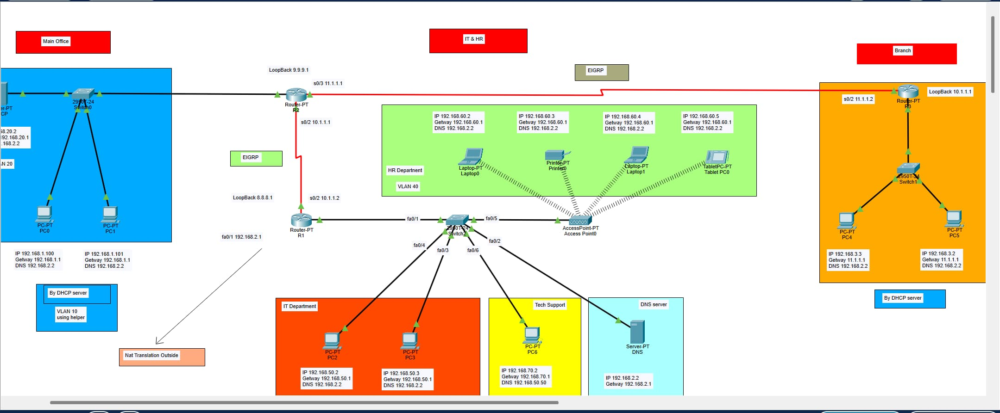

*الرسم البياني أعلاه يوضح الطوبولوجيا الكاملة من طرف إلى طرف عبر جميع المواقع الثلاثة.*

---

## 🏢 تفصيل المواقع

### 1️⃣ فرع المكتب (Branch Office)

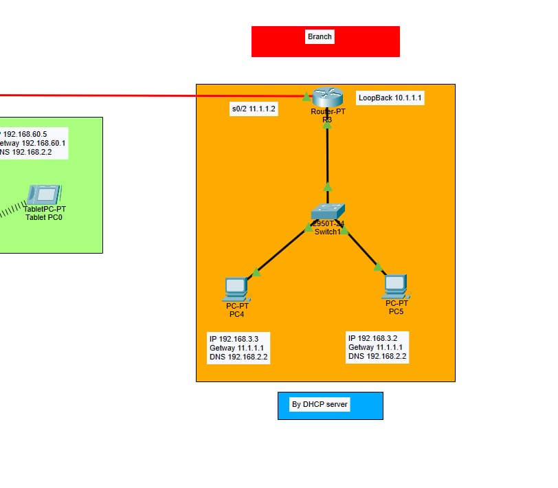

#### الأجهزة والشبكات
| العنصر | التفاصيل |
|--------|----------|
| **الأجهزة** | جهاز توجيه R3، مفتاح Switch1، PC4، PC5 |
| **الشبكة** | 192.168.3.0/24 (DHCP مفعّل) |
| **الروابط** | اتصال متسلسل بالمكتب الرئيسي (11.1.1.0/24) |
| **Loopback** | 10.1.1.1/32 |

#### تكوين EIGRP (R3)

```cisco
router eigrp 100
 network 192.168.3.0 0.0.0.255
 network 11.1.1.0 0.0.0.255
 network 10.1.1.0 0.0.0.255
 no auto-summary
```

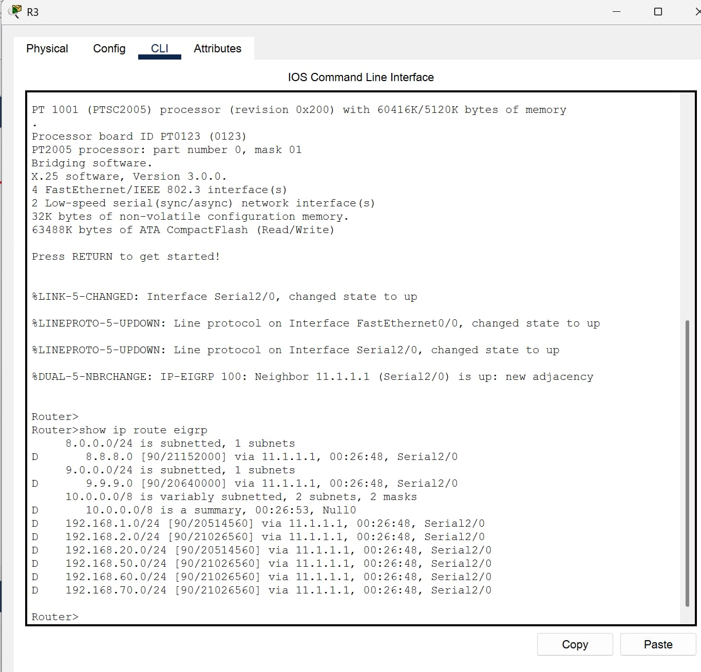

---

### 2️⃣ المكتب الرئيسي (Main Office)

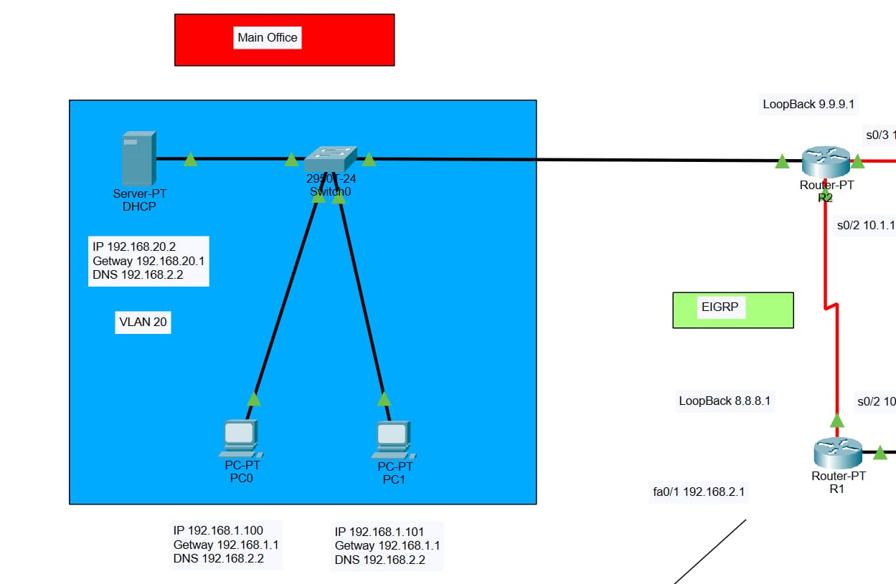

#### الأجهزة والشبكات
| العنصر | التفاصيل |
|--------|----------|
| **الأجهزة** | جهاز توجيه R2، مفتاح Switch0، خادم DHCP، PC0، PC1 |
| **VLANs** | VLAN 10 (users_office) و VLAN 20 (DHCP_server) |
| **الروابط** | متسلسل إلى R3 (11.1.1.0/24) ومتسلسل إلى R1 (10.1.1.0/24) |
| **Loopback** | 9.9.9.1/32 |

#### تكوين VLAN والـ Trunk (Switch0)

```cisco
vlan 10
 name users_office
!
vlan 20
 name DHCP_server
!
interface FastEthernet0/1
 switchport mode trunk
!
interface FastEthernet0/2
 switchport mode access
 switchport access vlan 20
!
interface FastEthernet0/3
 switchport mode access
 switchport access vlan 10
```

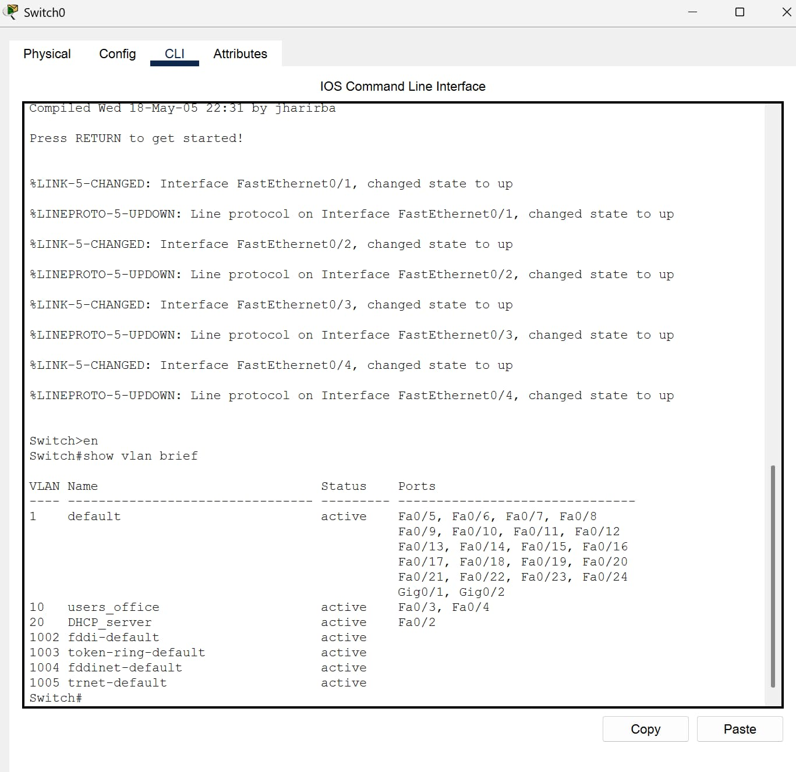

#### تكوين EIGRP (R2)

```cisco
router eigrp 100
 network 192.168.20.0 0.0.0.255
 network 192.168.1.0 0.0.0.255
 network 9.9.9.0 0.0.0.255
 network 10.0.0.0 0.0.0.255
 network 11.1.1.0 0.0.0.255
 no auto-summary
```

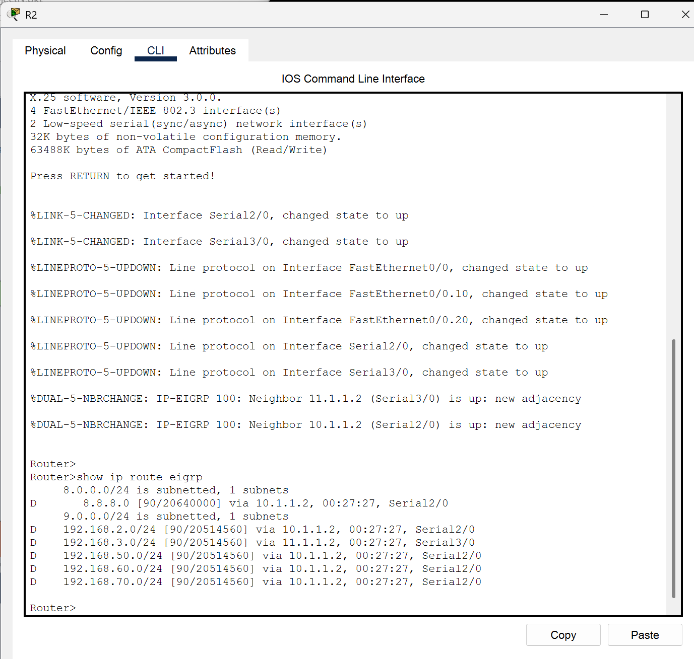

---

### 3️⃣ قسم تكنولوجيا المعلومات والموارد البشرية (IT & HR Department)

| العنصر | التفاصيل |
|--------|----------|
| **الأجهزة** | جهاز توجيه R1، مفتاح Switch2، أجهزة الحاسوب، خادم DNS، نقطة وصول |
| **الروابط** | متسلسل إلى R2 (10.1.1.0/24) |
| **Loopback** | 8.8.8.1/32 |

#### 3.1 قسم تكنولوجيا المعلومات (IT Department - VLAN 30)

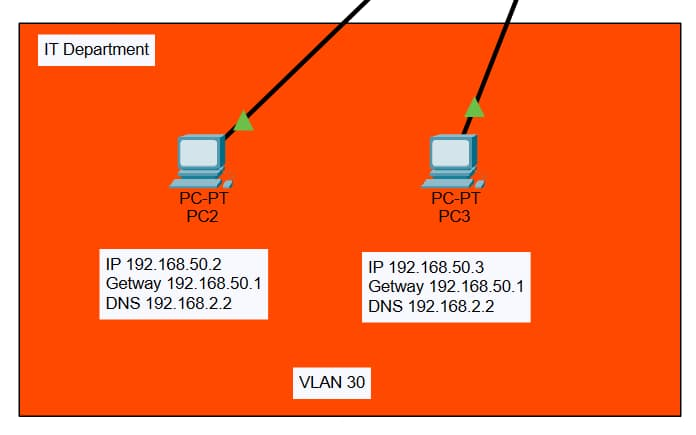

| الجهاز | عنوان IP | البوابة | DNS |
|-------|---------|--------|-----|
| PC2 | 192.168.50.2 | 192.168.50.1 | 192.168.2.2 |
| PC3 | 192.168.50.3 | 192.168.50.1 | 192.168.2.2 |

#### 3.2 قسم الموارد البشرية (HR Department - VLAN 40)

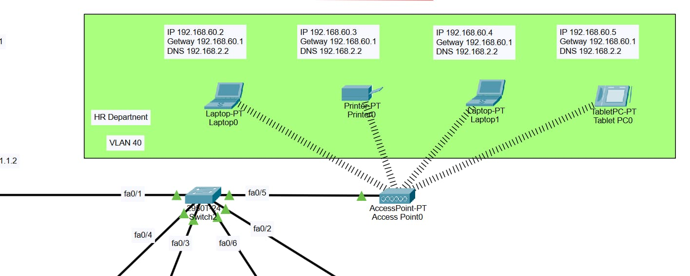

تتصل أجهزة الموارد البشرية لاسلكياً من خلال نقطة وصول (Access Point).

| الجهاز | عنوان IP | البوابة | DNS |
|-------|---------|--------|-----|
| Laptop0 | 192.168.60.2 | 192.168.60.1 | 192.168.2.2 |
| Printer0 | 192.168.60.3 | 192.168.60.1 | 192.168.2.2 |
| Laptop1 | 192.168.60.4 | 192.168.60.1 | 192.168.2.2 |
| Tablet PC0 | 192.168.60.5 | 192.168.60.1 | 192.168.2.2 |

#### 3.3 دعم التكنولوجيا (Tech Support - VLAN 14)

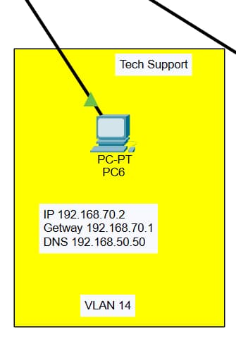

| الجهاز | عنوان IP | البوابة | DNS |
|-------|---------|--------|-----|
| PC6 | 192.168.70.2 | 192.168.70.1 | 192.168.50.50 |

#### 3.4 خادم DNS (VLAN 1)

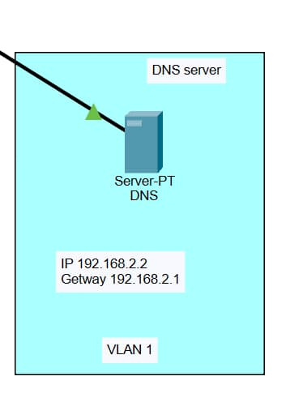

| الجهاز | عنوان IP | البوابة |
|-------|---------|--------|
| Server-PT DNS | 192.168.2.2 | 192.168.2.1 |

#### تكوين Router-on-a-Stick (R1)

```cisco
interface FastEthernet0/0.14
 encapsulation dot1Q 14
 ip address 192.168.70.1 255.255.255.0
!
interface FastEthernet0/0.40
 encapsulation dot1Q 40
 ip address 192.168.60.1 255.255.255.0
```

#### تكوين EIGRP (R1)

```cisco
router eigrp 100
 network 192.168.2.0 0.0.0.255
 network 192.168.50.0 0.0.0.255
 network 192.168.70.0 0.0.0.255
 network 10.1.1.0 0.0.0.255
 network 192.168.60.0 0.0.0.255
 network 8.8.8.0 0.0.0.255
 no auto-summary
```

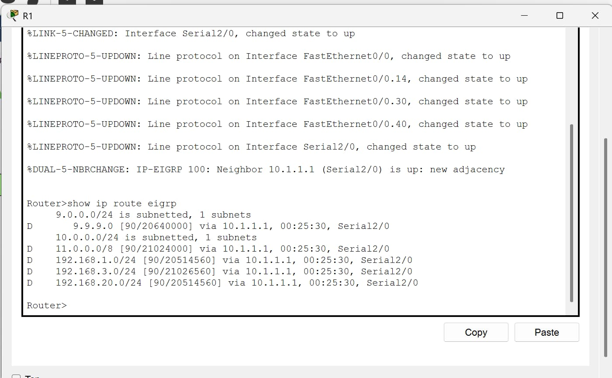

---

## 🛡️ قوائم التحكم بالوصول (ACLs)

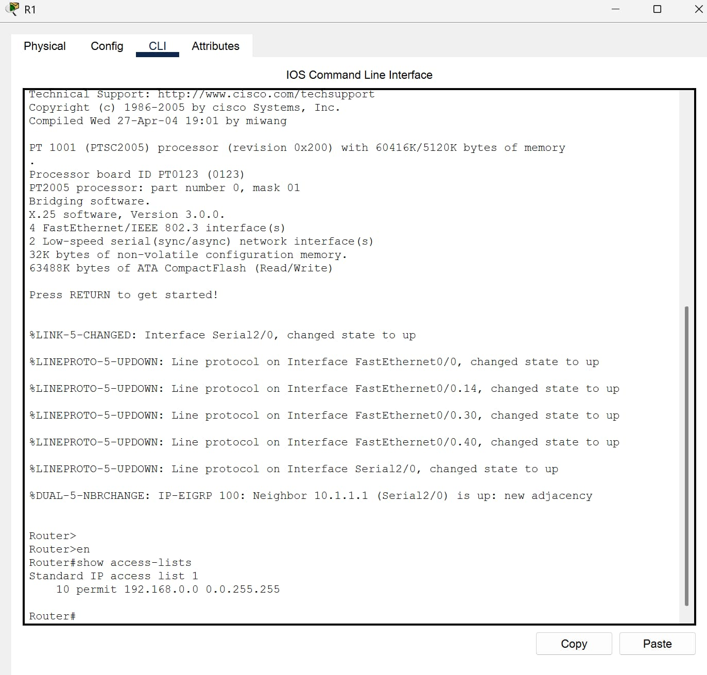

تم تطبيق قوائم ACL قياسية للتحكم في تدفق حركة المرور بين الأقسام المحددة، مما يضمن الامتثال لسياسات الأمان.

---

## 📊 ملخص عناوين IP

| الموقع | الشبكة | البوابة |
|--------|--------|--------|
| **فرع المكتب** | 192.168.3.0/24 | 192.168.3.1 |
| **المكتب الرئيسي** | 192.168.1.0/24 | 192.168.1.1 |
| **خادم DHCP** | 192.168.20.0/24 | 192.168.20.1 |
| **خادم DNS** | 192.168.2.0/24 | 192.168.2.1 |
| **قسم تكنولوجيا المعلومات** | 192.168.50.0/24 | 192.168.50.1 |
| **قسم الموارد البشرية** | 192.168.60.0/24 | 192.168.60.1 |
| **دعم التكنولوجيا** | 192.168.70.0/24 | 192.168.70.1 |
| **رابط R1 ↔ R2** | 10.1.1.0/24 | — |
| **رابط R2 ↔ R3** | 11.1.1.0/24 | — |

---

## 📂 ملفات المشروع

```
project-folder/
├── README.md                          # هذا الملف
├── network_project.pkt                # ملف محاكاة Cisco Packet Tracer
└── images/                            # مجلد يحتوي على جميع الرسوم البيانية
    ├── full-topology.jpg              # الطوبولوجيا الكاملة
    ├── branch.jpg                     # فرع المكتب
    ├── main-office.jpg                # المكتب الرئيسي
    ├── it-department.jpg              # قسم تكنولوجيا المعلومات
    ├── hr-department.jpg              # قسم الموارس البشرية
    ├── tech-support.jpg               # دعم التكنولوجيا
    ├── dns-server.jpg                 # خادم DNS
    ├── vlan-switch0.jpg               # تكوين VLAN على Switch0
    ├── eigrp-r1.jpg                   # جدول التوجيه على R1
    ├── eigrp-r2.png                   # جدول التوجيه على R2
    ├── eigrp-r3.jpg                   # جدول التوجيه على R3
    └── acl-config.jpg                 # تكوين قوائم التحكم بالوصول
```

---

## ⚙️ كيفية التشغيل والتحقق

### المتطلبات الأساسية
- Cisco Packet Tracer (الإصدار 8.x أو أعلى)
- نظام التشغيل: Windows أو macOS أو Linux

### خطوات التشغيل

1. **تثبيت Cisco Packet Tracer**
   ```bash
   # اذهب إلى: https://www.netacad.com/
      ```

2. **استنساخ أو تحميل المشروع**
   ```bash
   git clone https://github.com/your-username/Network-Project.git
   cd Network-Project
   ```

3. **فتح ملف الباكت**
   - افتح Cisco Packet Tracer
   - اذهب إلى: File → Open
   - حدد `network_project.pkt`

4. **التحقق من الاتصال end-to-end**
   ```
   من PC2 إلى PC4 (اختبار عبر المواقع المختلفة)
   أمثلة على أوامر Ping:
   - PC2 → PC4 (من IT إلى Branch)
   - PC0 → Laptop0 (من Main Office إلى HR)
   ```

5. **التحقق من جداول التوجيه EIGRP**
   ```cisco
   R1# show ip route eigrp
   R2# show ip route eigrp
   R3# show ip route eigrp
   ```

6. **التحقق من تكوينات VLAN**
   ```cisco
   Switch0# show vlan brief
   Switch2# show vlan brief
   ```

7. **التحقق من حالة الروابط المتسلسلة**
   ```cisco
   R1# show interfaces serial 0/0
   R2# show interfaces serial 0/0
   R2# show interfaces serial 0/1
   R3# show interfaces serial 0/0
   ```

8. **اختبار خدمات DHCP و DNS**
   ```
   قم بتحديث IP للأجهزة المحمولة والتحقق من حصول الأجهزة على عناوين IP من خادم DHCP
   جرب استعلامات DNS من خادم DNS المركزي
   ```

---

## 🔍 المقاييس الأداء والتحقق

### اختبارات الاتصال (Connectivity)
- ✅ Ping بين جميع الأجهزة في نفس VLAN
- ✅ Ping بين VLANs المختلفة عبر R1
- ✅ Ping عبر المواقع (Branch ↔ Main Office ↔ IT & HR)

### التحقق من التوجيه (Routing)
- ✅ جميع الشبكات مرئية في جداول التوجيه
- ✅ EIGRP يعلن بشكل صحيح عن جميع الشبكات
- ✅ الروابط المتسلسلة مفعلة وتعمل

### التحقق من الخدمات (Services)
- ✅ خادم DHCP يوزع عناوين IP بنجاح
- ✅ خادم DNS يحل الأسماء بشكل صحيح
- ✅ نقطة الوصول توفر اتصالاً لاسلكياً آمناً

---

## 📝 ملاحظات مهمة

> **ملاحظة 1:** جميع الأجهزة مكونة مسبقاً في ملف `.pkt`. لا تحتاج إلى إعادة تكوين يدوية إلا إذا كنت تريد اختبار تغييرات معينة.

> **ملاحظة 2:** الشبكة محسّنة لأغراض تعليمية وسهولة الفهم. في الإنتاج، قد تحتاج إلى اعتبارات إضافية للأمان والأداء.

> **ملاحظة 3:** تأكد من أن جميع الأجهزة متصلة بالشبكة بشكل فعلي (الروابط خضراء في Packet Tracer).

---

## 👨‍💻 المؤلف

**Zeyad**

---

## 📜 الترخيص

هذا المشروع متاح للاستخدام التعليمي. يرجى عدم استخدامه لأغراض تجارية دون إذن.

---

## 📞 التواصل والدعم

في حالة وجود أي استفسارات أو مشاكل:
- تحقق من أن جميع الأجهزة متصلة بشكل صحيح
- تأكد من أن الإصدار الصحيح من Cisco Packet Tracer مثبت

